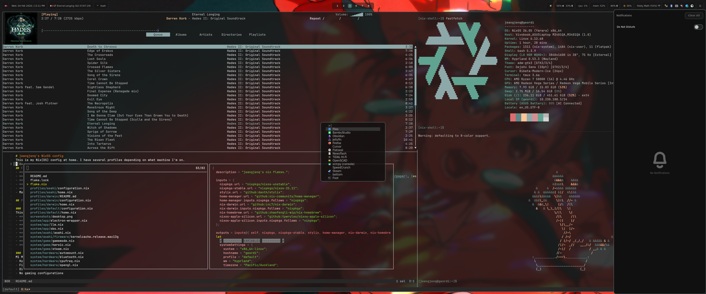

# jeangjenq's NixOS config
This is my Nix(OS) config at home. I have several profiles depending on what machine I'm on.


## Features
- **[Stylix](https://github.com/danth/stylix)** for consistent theming across the system.
- **[Window manager](#window-managers)**: Choose between [Hyprland](https://wiki.hypr.land/) or [Sway](https://swaywm.org/)
  - **Hyprland**: with [hypridle](https://github.com/hyprwm/hypridle), [hyprlock](https://github.com/hyprwm/hyprlock), [hyprpaper](https://github.com/hyprwm/hyprpaper)
  - **Sway**: with [swayidle](https://github.com/swaywm/swayidle), [swaylock](https://github.com/swaywm/swaylock), [workstyle](https://github.com/pierrechevalier83/workstyle)
  - Shared: [swaync](https://github.com/ErikReider/SwayNotificationCenter)
  - A minimal GNOME configuration is available as a fallback DE when a full desktop environment is needed:
    - `system/wm/gnome.nix` - Enables GDM + GNOME with bloat removed (maps, weather, camera apps, etc.) and appindicator extension
    - `user/wm/gnome.nix` - dconf settings for dark mode, flat mouse accel, privacy settings, and power management
- **[Waybar](https://github.com/Alexays/Waybar)** with a recorder button that toggles recording a selected region on screen
- **[Kitty](https://sw.kovidgoyal.net/kitty/)** terminal with shell [preferences](./user/shell/sh.nix)
- **[Helix](https://helix-editor.com/)** editor with some [preferences](./user/shell/helix.nix)
- **[Firefox](https://www.mozilla.org/firefox/)** with custom policies via home-manager
- **[Laptop module](./user/wm/laptop.nix)**: power-aware display mode (uses a lower-res mode on battery by picking the 3rd available mode), clamshell support, touchpad tuning, and a user-level systemd timer to keep it in sync
- Modular structure separating system and user configurations, controlled by `flake.nix` variables:
  - **`systemSettings`**: `system`, `hostname`, [`profile`](#profiles), `wm`, `timezone`, `locale`
  - **`userSettings`**: `username`, `email`, `dotfilesDir`, `term`, `launcher`, `monitors` (`primary`, `vertical`, `lapt`)

## Profiles

### default
This is my most comprehensive profile for home PC (x86_64). Notable features:
- **Gaming**: Steam with gamescope (HDR enabled), gamemode, mangohud
- **Virtualization**: virt-manager with QEMU/KVM
- **Hardware**: TLP power management, Vial keyboard config, bluetooth, printing
- **Media**: OBS Studio, mpd + rmpc, mpv, jellyfin-media-player
- **Apps**: VSCodium, Cursor, LibreOffice, Obsidian, Thunderbird, Vesktop
- **Creative**: GIMP, Shotcut, DigiKam, Darktable, Siril, Hugin, OpenSCAD
- **Network**: Wireguard VPN, sshd, Nextcloud
- **Other**: Flatpak enabled, electron-wrapper for apps like Signal, local LLM support

### darwin
nix-darwin config for M1 Macbook Air on MacOS. Uses home-manager as a module.
- Apps installed via nix-homebrew (Firefox, Thunderbird, Signal, Discord, Steam, etc.)

### asahi (deprecated)
M1 Macbook Air running NixOS via nixos-apple-silicon. Lighter profile with:
- Hyprland WM
- Firefox, Thunderbird, VSCodium
- DigiKam, Darktable for photo management
- No gaming configurations

> **Note:** I no longer use this profile. The M1 Mac doesn't have enough storage for dual booting, and running Asahi Linux significantly reduces battery life.

## Install on a new system
1. Clone this repository into home folder as `.dotfiles`:
2. Adjust settings in [flake.nix](./flake.nix):
   - `systemSettings.system` - architecture (e.g., `x86_64-linux`, `aarch64-darwin`)
   - `systemSettings.hostname`
   - `systemSettings.profile` - profile to use (`default`, `asahi`, or `darwin`)
   - `systemSettings.wm` - window manager (`hyprland` or `sway`)
   - `userSettings.username`

### NixOS
1. Replace the `hardware-configuration.nix` in system folder by running
   ```bash
   sudo nixos-generate-config --show-hardware-config > system/hardware-configuration.nix
   ```
   Although `hardware-configuration.nix` itself caution against editing it, I tend to edit the `fileSystems` section in it at this stage to configure mounting any network shares.
1. Change boot mode in (configuration.nix)[./profiles/work/configuration.nix] if necessary, using `/etc/nixos/configuration.nix` as a reference.
1. Rebuild with flake.
   ```bash
   sudo nixos-rebuild switch --flake ~/.dotfiles#system
   ```
1. If the rebuild went well, install and build home-manager configuration.
   ```bash
   nix run home-manager/master --extra-experimental-features nix-command --extra-experimental-features flakes -- switch --flake ~/.dotfiles#user
   ```

### MacOS
1. First we must install MacOS's command line tools by executing
   ```bash
   xcode-select --install
   ```
1. [Install nix package manager](https://nixos.org/download/) and follow its instructions.
1. Run the following command to apply system configurations.
   ```bash
   nix run nix-darwin --extra-experimental-features "nix-command flakes" -- switch --flake ~/.dotfiles#system
   ```
1. darwin profile installs `firefox` via `nix-homebrew`. But I couldn't get `home-manager` to deploy my desired firefox policies. So in darwin profile I place the firefox's `policies.json` in `/etc` and manually link it to where it should go with this command.
```bash
sudo mkdir -p /Applications/Firefox.app/Contents/Resources/distribution
sudo ln -s /etc/firefox/policies.json /Applications/Firefox.app/Contents/Resources/distribution/policies.json
```

## Rebuilding

### NixOS
System and user configs are separate, so you can rebuild them independently.

**System:**

```bash
sudo nixos-rebuild switch --flake ~/.dotfiles#system
```

**User:**

```bash
home-manager switch --flake ~/.dotfiles#user
```

### MacOS
Darwin profile includes home-manager as a module, so both rebuild together:

```bash
darwin-rebuild switch --flake ~/.dotfiles#system
```

For user-only changes:

```bash
home-manager switch --flake ~/.dotfiles#user
```

## Directory Structure
```
.dotfiles/
├── flake.nix              # Main flake with system/user settings
├── profiles/              # Per-machine profiles
│   ├── default/           # x86_64 desktop/laptop
│   ├── asahi/             # M1 Mac running NixOS
│   └── darwin/            # M1 Mac running MacOS
├── system/                # System-level NixOS modules
│   ├── app/               # System apps (OBS, LLM, electron-wrapper)
│   ├── game/              # Gaming (Steam, gamescope, gamemode)
│   ├── hardware/          # Hardware configs (bluetooth, TLP, etc.)
│   ├── network/           # Network (sshd, wireguard)
│   ├── virtualization/    # QEMU/KVM setup
│   └── wm/                # Window manager system config (incl. gnome.nix fallback)
├── user/                  # User-level home-manager modules
│   ├── app/               # Apps (browser, editor, media)
│   ├── shell/             # Shell tools (kitty, helix, yazi)
│   └── wm/                # WM user config
│       ├── hyprland.nix   # Hyprland config (imports laptop.nix)
│       ├── sway.nix       # Sway config (imports laptop.nix)
│       ├── laptop.nix     # Shared laptop module (power, clamshell)
│       ├── commons.nix    # Shared WM utilities (waybar, swaync, etc.)
│       ├── gnome.nix      # GNOME dconf settings (fallback DE)
│       └── ...            # Other WM-related configs
└── themes/                # Stylix config and wallpapers
```
