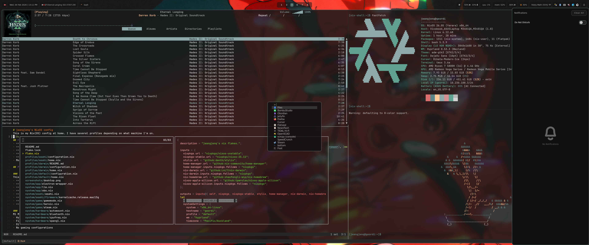

# jeangjenq's NixOS config


# Notable features
## Window managers workflow
I primarily use [sway](https://swaywm.org) but occasionally switch to [Hyprland](https://wiki.hypr.land)
for more bleeding-edge features (like HDR). So I configured my system to work around these two WM.

### Dmenu
I am currently using [rofi](https://github.com/davatorium/rofi) as drun and dmenu.
I've set up a somewhat modular system in [dmenu.nix](./user/wm/dmenu.nix) that should make swapping out rofi easy.

### Ricing
Ricing is done with [Stylix](https://github.com/nix-community/stylix) for most applicications.
I try not to go overboard with custom styling and just let Stylix handle most of it.
Execpt for some overrides here and there like in [waybar](./user/wm/waybar.nix)

### [Helix](https://helix-editor.com/) configuration
A Helix [config](./user/app/editor/helix.nix) that works for me.

## Profiles
The profile system is created with expansion in mind. One day I might create more profiles for
headless server or for work.

### default 
My "default" x86_64 system profile.

### darwin
Using nix as package manager for my M1 Mac.

# Install on a new system

1. Clone this repository, I prefer `.dotfiles` folder in `$HOME`:
1. Adjust variables in [flake.nix](./flake.nix):
   - `systemSettings.hostname`
   - `systemSettings.system`
      - `x86_64-linux`
      - `aarch64-darwin`
   - `systemSettings.profile`
      - `default`: My x86 [profile](#profiles).
      - `darwin`: My MacOS [profile](#profiles).
   - `systemSettings.wm`
      - `sway`
      - `hyprland`
      - `gnome`: A [minimal gnome](./system/wm/gnome.nix) [config](./user/wm/gnome.nix) is available for the times I put this on a laptop with touchscreen.
      - `cosmic`: For trying out [System76's cosmic](https://system76.com/cosmic).
         > [!WARNING] Switching from other WM to this can screw up [secrets](https://www.freedesktop.org/wiki/Specifications/secret-storage-spec/) storage.
   - `userSettings` as you see fit.

## NixOS

1. Replace the `hardware-configuration.nix` in system folder by running
   ```bash
   sudo nixos-generate-config --show-hardware-config > system/hardware-configuration.nix
   ```
1. Change boot mode in (configuration.nix)[./profiles/default/configuration.nix] if necessary, using `/etc/nixos/configuration.nix` as a reference.
1. Rebuild with flake.
   ```bash
   sudo nixos-rebuild switch --flake ~/.dotfiles#default
   ```

## MacOS

1. First we must install MacOS's command line tools by executing
   ```bash
   xcode-select --install
   ```
1. [Install nix package manager](https://nixos.org/download/), follow its instructions.
1. Run the following command to apply system configurations.
   ```zsh
   nix run nix-darwin --extra-experimental-features "nix-command flakes" -- switch --flake ~/.dotfiles#default
   ```
1. darwin profile installs `firefox` via `nix-homebrew`. But I couldn't get `home-manager` to deploy my desired firefox policies.
   So in darwin profile I place the firefox's `policies.json` in `/etc` and manually link it to where it should go with this command.
   ```zsh
   sudo mkdir -p /Applications/Firefox.app/Contents/Resources/distribution
   sudo ln -s /etc/firefox/policies.json /Applications/Firefox.app/Contents/Resources/distribution/policies.json
   ```
   Unfortunately since we altering a Homebrew package content, Mac won't be very happy with it and will quarantine the program.
   This takes care of that.
   ```zsh
   xattr -r -d com.apple.quarantine /Applications/Firefox.app
   ```

# Rebuilding

## NixOS
```bash
sudo nixos-rebuild switch --flake ~/.dotfiles#default
```

## MacOS
```bash
sudo darwin-rebuild switch --flake ~/.dotfiles#default
```
